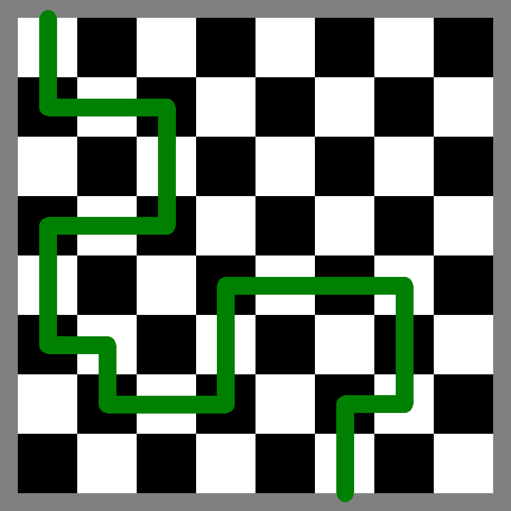

# mazes

This script creates every possible single-path maze through an n*n board, following these rules:

* There is only one safe path from the bottom of the map to the top of the map.
* Each square along the top and bottom rows are unsafe except for one.
* UP, RIGHT, DOWN, and LEFT moves only
* There is only one safe move from any square along the path.

## Backstory
I worked at a summer camp for several years, and we would sometimes play a game using a giant 8ft x 8ft checkerboard. The counlselor leading the game has a "map" through the board that only they can see. Each other player tries one at a time to cross the board. If they step off the "path" they are sent to the back of the line. The players eventually learn the path by watching the attempts of their teammates and they win once they send a player though the entire maze. 

This script generates every possible maze for this game. And it does it pretty efficiently through recursion and back-tracking.
